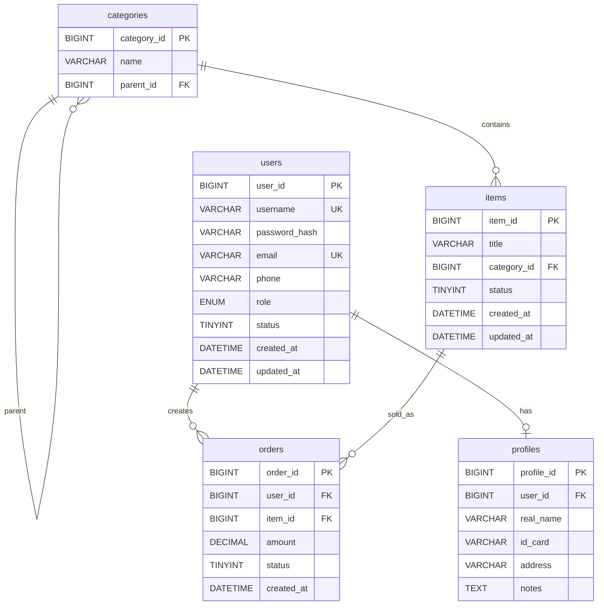

# MySQL E-R 图

## 1. 实体说明

MySQL 负责存储强一致的核心业务数据，包括用户、分类、景点、订单、用户档案。MongoDB 文档通过 `user_id` 和 `item_id` 引用 MySQL 中的用户和景点数据。

## 2. E-R 图

## 3. 关系说明

| 关系 | 类型 | 说明 |
| --- | --- | --- |
| users - profiles | 1:0..1 | 一个用户最多一份用户档案 |
| users - orders | 1:N | 一个用户可以创建多个订单 |
| categories - categories | 1:N | 分类支持父子层级 |
| categories - items | 1:N | 一个分类包含多个景点 |
| items - orders | 1:N | 一个景点可以产生多个订单 |

## 4. 索引规划

| 表 | 字段 | 类型 | 用途 |
| --- | --- | --- | --- |
| users | username | 唯一索引 | 登录与注册去重 |
| users | email | 唯一索引 | 注册去重 |
| users | role, status | 普通索引 | 后台用户筛选 |
| categories | parent_id | 普通索引 | 查询子分类 |
| items | category_id, status | 普通索引 | 景点分类与状态查询 |
| orders | user_id, created_at | 普通索引 | 用户订单查询 |
| orders | item_id, status | 普通索引 | 景点订单统计 |

## 5. 视图、存储过程与触发器规划

| 类型 | 名称 | 说明 |
| --- | --- | --- |
| 视图 | v_user_profile | 用户与档案详情视图 |
| 视图 | v_item_order_summary | 景点订单汇总视图 |
| 存储过程 | sp_monthly_order_report | 月度订单金额与数量报表 |
| 存储过程 | sp_update_inactive_items | 批量更新景点状态 |
| 触发器 | trg_orders_before_insert | 订单创建前校验金额 |
| 触发器 | trg_items_before_update | 景点更新时维护 updated_at |
