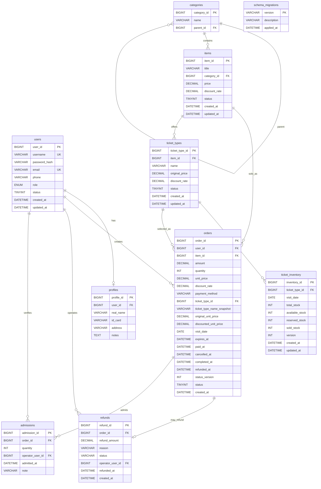

# MySQL E-R 图

更新时间：2026-07-14（M10 实库校准）

## 1. 实体说明

MySQL 负责存储强一致的核心业务数据，包括用户、分类、景点、订单、用户档案。MongoDB 文档通过 `user_id` 和 `item_id` 引用 MySQL 中的用户和景点数据。

## 2. E-R 图

## 3. 关系说明

| 关系 | 类型 | 说明 |
| --- | --- | --- |
| users - profiles | 1:0..1 | 一个用户最多一份用户档案 |
| users - orders | 1:N | 一个用户可以创建多个订单 |
| categories - categories | 1:N | 分类支持父子层级 |
| categories - items | 1:N | 一个分类包含多个景点 |
| items - orders | 1:N | 一个景点可以产生多个订单 |
| items - ticket_types | 1:N | 一个景点可配置成人、儿童、学生及其他票种 |
| ticket_types - ticket_inventory | 1:N | 每个票种按游玩日期维护库存 |
| ticket_types - orders | 1:N | 新订单引用一个票种并保存价格快照；旧订单允许兼容空引用 |
| orders - refunds | 1:0..1 | 一个订单最多一条成功模拟退款记录 |
| orders - admissions | 1:N | 支持分次数量核销，累计不得超过订单数量 |

`schema_migrations` 是独立的版本记录表，不参与业务外键关系。M10 全新安装实库共 10 张表：5 张课程原表、4 张票务扩展表和 1 张迁移记录表。

## 4. 索引规划

| 表 | 字段 | 类型 | 用途 |
| --- | --- | --- | --- |
| users | username | 唯一索引 | 登录与注册去重 |
| users | email | 唯一索引 | 注册去重 |
| users | role, status | 普通索引 | 后台用户筛选 |
| categories | parent_id | 普通索引 | 查询子分类 |
| items | category_id, status | 普通索引 | 景点分类与状态查询 |
| items | status, updated_at, item_id | 普通索引 | 后台状态与更新时间分页 |
| orders | user_id, created_at | 普通索引 | 用户订单查询 |
| orders | item_id, status | 普通索引 | 景点订单统计 |
| orders | status, created_at | 普通索引 | 过期/状态批量扫描 |
| ticket_types | item_id, status | 普通索引 | 查询景点可售票种 |
| ticket_inventory | ticket_type_id, visit_date | 唯一索引 | 锁定单票种单日期库存行 |
| ticket_inventory | visit_date, available_stock | 普通索引 | 查询日期可售库存 |
| refunds | order_id | 唯一索引 | 防止重复退款 |
| admissions | order_id, admitted_at | 普通索引 | 累计核销数量与记录追踪 |

## 5. 视图、存储过程与触发器规划

| 类型 | 名称 | 说明 |
| --- | --- | --- |
| 视图 | v_user_profile | 用户与档案详情视图 |
| 视图 | v_item_order_summary | 景点订单汇总视图 |
| 存储过程 | sp_monthly_order_report | 月度订单金额与数量报表 |
| 存储过程 | sp_update_inactive_items | 批量更新景点状态 |
| 触发器 | trg_orders_before_insert | 订单创建前校验金额 |
| 触发器 | trg_items_before_update | 景点更新时维护 updated_at |

## 6. Day09 兼容说明

- `users`、`categories`、`items`、`orders`、`profiles` 及课程字段全部保留。
- `orders.ticket_type_id` 对历史订单保持可空；迁移优先关联同景点“成人票”，并保存名称、原价、折后价、日期与时间快照。
- 新业务只能通过服务层创建字段完整的订单；兼容空值不等于允许新订单缺字段。
- `ticket_inventory` 使用 available/reserved/sold 三段库存，三者之和不得超过 total，所有值不得为负。

## 7. M10 真实结构校准

- 全新 `scenic_ticket_test` 安装实测：10 表、12 外键、2 视图、2 存储过程、2 触发器、4 条迁移记录。
- 初始化后包含 60 个票种与 420 条每日库存，非法库存记录为 0。
- Day08 历史夹具升级后，原用户、档案、订单及课程字段全部保留，并补齐票种、价格快照和生命周期字段。
- `orders.status`：`0=待支付`、`1=已支付`、`2=已取消/已退款`、`3=已完成`；`status_version` 用于状态并发控制，退款事实以 `refunds` 记录和 `refunded_at` 辅助区分。
