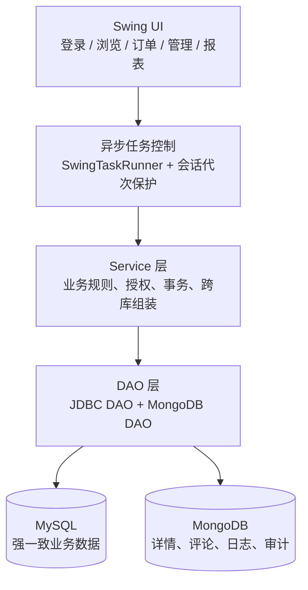
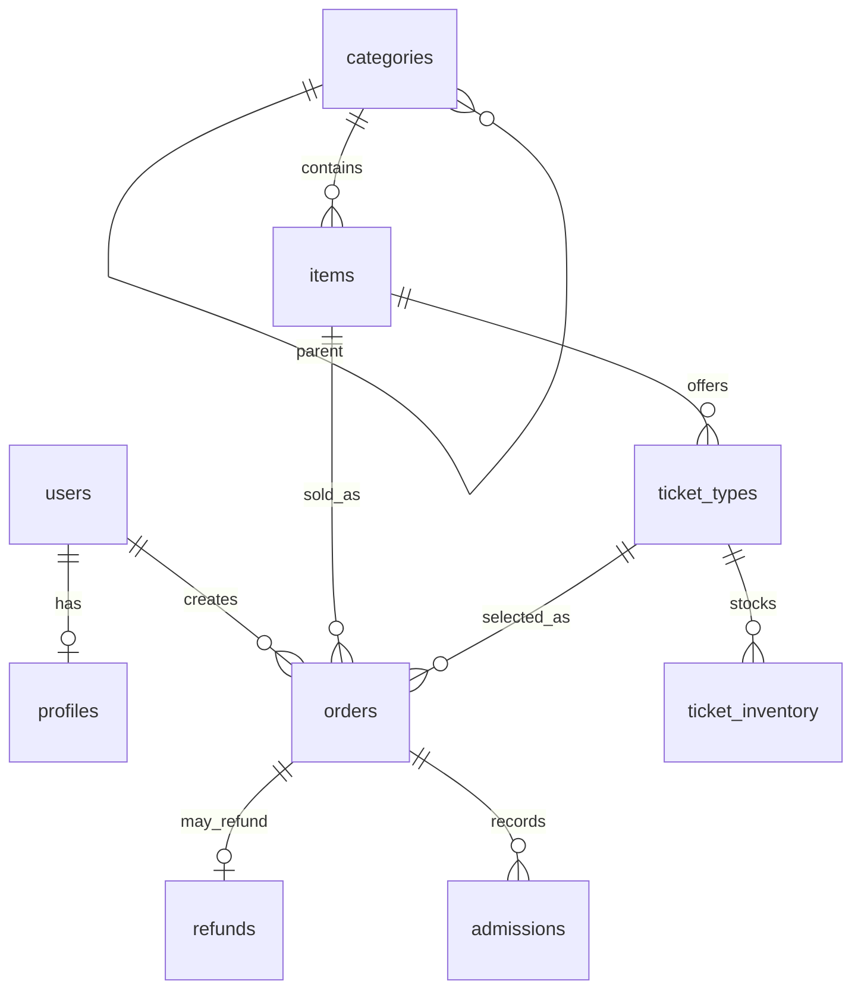
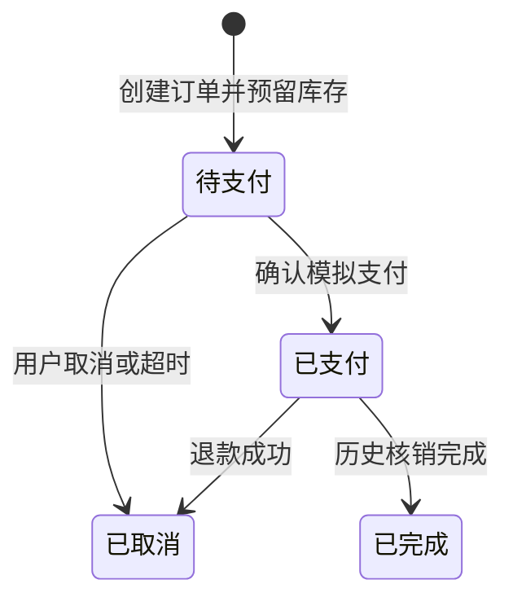

# 景点售票系统技术设计文档

> 版本：1.0
> 更新日期：2026-07-15
> 项目名称：景点售票系统（scenic-ticket）

## 1. 文档目的与项目范围

本文档说明景点售票系统的总体架构、数据库设计、核心模块、关键业务流程、安全与一致性策略、前端设计、部署运行和测试方案，可作为课程答辩的技术设计交付物。

系统是基于 Java Swing 的桌面售票应用，采用 **MySQL + MongoDB** 双数据库架构，覆盖以下功能：

- 用户注册、登录、个人档案和角色权限；
- 景点及分类浏览、景点详情、图片展示；
- 票种、按游玩日期维护的库存、下单、模拟支付、取消和退款；
- 已购票用户的 1～5 分评分与评论；
- 评分推荐、月度订单、热门排行、用户报告和综合汇总；
- 管理员的景点、分类、用户、票种/库存管理及系统审计。

当前后台界面不展示门票核销入口；底层保留历史核销数据结构与“已核销订单不可退款”的业务校验，以兼容已有订单数据。

### 1.1 2026-07-15 版本修订

- 前台推荐统一调整为按游客平均评分排序的 5 分制评分推荐；
- 评论标签已从数据、界面、审计与统计中移除；
- 月度订单报表支持按日期钻取购买用户、景点、票种和金额明细；
- 管理端景点编辑统一为一个“保存景点修改”操作，图片改为拖拽导入，开放信息改为结构化字段；
- 所有业务日期统一采用可切换月份的月历选择；
- 新景点自动建立成人票与未来 31 天库存；
- 报表和审计页面的当前功能按钮以绿色状态标识。

## 2. 技术选型

| 类别 | 技术 | 用途 |
| --- | --- | --- |
| 开发语言 | Java 21 | 业务逻辑与桌面客户端 |
| 图形界面 | Java Swing | 登录、用户端、管理端、报表和审计页面 |
| 构建工具 | Maven 3.8+ | 依赖管理、编译、测试、启动 |
| 关系型数据库 | MySQL 8.0+ | 用户、景点、订单、票种、库存、退款等强一致业务数据 |
| 文档数据库 | MongoDB 5.0+ | 景点详情、评论、行为日志、系统审计及聚合分析 |
| 数据访问 | JDBC、MySQL Connector/J、MongoDB Java Sync Driver | 双数据库访问 |
| 连接池 | HikariCP | MySQL 连接复用 |
| 安全 | jBCrypt | 密码哈希与校验 |
| 日志 | SLF4J + Logback | 运行日志与故障定位 |
| 测试 | JUnit 5 | 单元测试、组件测试、真实数据库集成测试 |

## 3. 总体架构

系统采用分层设计。Swing 界面只负责输入、展示和交互；Service 层负责权限、规则、事务和跨库协调；DAO 层负责数据库读写；DTO 用于服务层与界面层之间的数据传递。



### 3.1 代码结构

```text
src/main/java/com/scenicticket/
├── config/       数据库配置、测试库保护
├── dao/mysql/    MySQL 数据访问对象
├── dao/mongo/    MongoDB 数据访问对象
├── dto/          界面和服务层的数据传输对象
├── exception/    业务与数据库异常
├── model/        用户、景点、订单、票种等实体
├── service/      业务服务、授权、事务、跨库查询
├── ui/           Swing 页面、弹窗、表格模型、日期组件
├── util/         连接、密码和安全工具
└── Main.java     程序入口
```

主要页面由 `AppFrame` 装配；登录、注册、景点浏览、订单、后台管理、统计报表和系统审计均拆分为独立面板。数据库操作通过后台任务执行，避免阻塞界面线程；同一请求采用最新结果保护，会话切换后旧任务不能回写新账号界面。

## 4. 数据库设计

### 4.1 双数据库职责划分

| 数据库 | 数据类型 | 主要内容 |
| --- | --- | --- |
| MySQL | 强一致、事务型数据 | 用户、档案、分类、景点、票种、每日库存、订单、退款、核销记录、迁移记录 |
| MongoDB | 半结构化、高写入与聚合数据 | 景点详情、图片、评论、用户行为日志、系统审计日志 |

MySQL 的 `users.user_id` 与 `items.item_id` 是跨库关联主键。MongoDB 只保存引用 ID 和扩展数据，不复制 MySQL 的完整主数据；跨库数据由 Service 层查询并组装为 DTO。

### 4.2 MySQL 核心实体关系



| 表 | 关键字段 | 职责 |
| --- | --- | --- |
| `users` | `user_id`、`username`、`password_hash`、`role`、`status` | 账号、角色、启禁状态 |
| `profiles` | `user_id`、真实姓名、证件号、地址 | 用户档案 |
| `categories` | `category_id`、`parent_id`、`name` | 支持树形分类 |
| `items` | `item_id`、`category_id`、`price`、`discount_rate`、`status` | 景点基础信息与展示价格 |
| `ticket_types` | `ticket_type_id`、`item_id`、原价、优惠、状态 | 同一景点的成人票等多票种 |
| `ticket_inventory` | `ticket_type_id`、`visit_date`、总库存、可售、预留、已售 | 一票种一日期一条库存记录 |
| `orders` | 用户、景点、票种、日期、数量、价格快照、状态、时间戳 | 订单全生命周期事实源 |
| `refunds` | `order_id`、退款金额、操作人、退款时间 | 模拟退款记录；同一订单最多一条成功记录 |
| `admissions` | `order_id`、数量、操作人、时间 | 历史入园核销记录 |
| `schema_migrations` | 版本、描述、执行时间 | 数据库迁移版本控制 |

订单状态定义：`0=待支付`、`1=已支付`、`2=已取消/已退款`、`3=已完成`。订单还保存票种名称、原价、优惠、折后单价、游玩日期和支付方式快照，避免后续票价调整改变历史订单。

### 4.3 MySQL 索引、视图与数据库对象

- `users.username`、`users.email` 使用唯一索引，保证注册去重；
- `items(category_id, status)`、`ticket_types(item_id, status)` 支持景点和可售票种查询；
- `ticket_inventory(ticket_type_id, visit_date)` 使用唯一索引，保证单票种单日期只有一条库存；
- `orders(user_id, created_at)`、`orders(status, created_at)` 支持用户订单与过期扫描；
- `refunds.order_id` 使用唯一索引，避免重复退款。

数据库对象包括：

| 类型 | 名称 | 作用 |
| --- | --- | --- |
| 视图 | `v_user_profile` | 用户与档案详情查询 |
| 视图 | `v_item_order_summary` | 景点订单汇总 |
| 存储过程 | `sp_monthly_order_report` | 月度订单数量与销售额报表 |
| 存储过程 | `sp_update_inactive_items` | 批量维护景点状态 |
| 触发器 | `trg_orders_before_insert` | 订单创建前金额校验 |
| 触发器 | `trg_items_before_update` | 景点更新时维护更新时间 |

### 4.4 MongoDB 集合设计

| 集合 | 核心字段 | 用途 |
| --- | --- | --- |
| `action_logs` | `user_id`、`item_id`、`action_type`、`duration_seconds`、`created_at` | 浏览、搜索、下单、评论等行为日志，用于热门和用户行为分析 |
| `comments` | `user_id`、`item_id`、`rating`、`content`、`created_at`、`updated_at` | 1～5 分评分与评论正文 |
| `item_details` | `item_id`、`description`、`images`、`metadata`、`updated_at` | 景点长介绍、图片和开放信息 |
| `system_logs` | `user_id`、`log_type`、`log_level`、`message`、`action_detail`、`timestamp` | 登录、管理操作和错误审计 |

`comments(user_id, item_id)` 使用唯一索引，保证一个用户对同一景点只保留一条评论；再次提交会更新原评论。`item_details.item_id` 的规范类型为数值，读取时兼容历史数字字符串，下一次管理员保存时原位规范化，避免出现重复详情文档。

评论不保存“标签”字段；系统已移除评论标签的输入、展示、统计与审计字段。

### 4.5 MongoDB 聚合

| 聚合 | 数据来源 | 输出 |
| --- | --- | --- |
| 热门景点排行 | `action_logs` | 景点总操作、浏览、下单、平均停留时间 |
| 用户行为报告 | `action_logs` | 指定用户的浏览、搜索、评论、下单等行为统计 |
| 评分汇总与分布 | `comments` | 评论数、平均分、最高分、最低分及各评分数量 |
| 审计汇总和趋势 | `system_logs` | 按日志类型、等级、日期、用户的操作统计 |

## 5. 核心功能模块设计

### 5.1 用户、权限和档案

`UserService` 负责注册、登录、退出和档案更新。密码使用 BCrypt 哈希保存，不保存明文密码。`AuthorizationService` 在 Service 层回查当前账号的启用状态和角色，不能仅依赖界面隐藏按钮。

管理员可查询用户、查看档案和订单概况、启用或禁用账号、调整普通用户角色。系统禁止管理员禁用自身，也禁止禁用或删除最后一个有效管理员。用户状态/角色修改在同一个 MySQL 事务中锁定操作人、目标用户和有效管理员集合，提交后再写 MongoDB 审计。

### 5.2 景点与分类管理

`BusinessService` 管理分类树、景点基础信息和景点详情。分类支持父子关系，修改父级时校验循环引用。景点基础数据写入 MySQL `items`，简介、图片和扩展元数据写入 MongoDB `item_details`。

创建景点时，系统自动创建一个与景点售价相同的“成人票”，并生成未来 31 天、每天 100 张的库存，确保新景点创建后即可购票。景点详情保存失败时，服务会尝试将该景点下架并返回明确告警，避免无详情景点继续售卖。

### 5.3 票种与每日库存

`TicketInventoryService` 管理票种和每日库存。票种拥有独立的原价、优惠比例和上下架状态；库存按“票种 + 游玩日期”维护以下字段：

```text
total_stock = available_stock + reserved_stock + sold_stock
```

库存修改使用 MySQL 事务与 `SELECT ... FOR UPDATE` 行锁：

- 创建待支付订单：`available_stock` 减少，`reserved_stock` 增加；
- 支付成功：`reserved_stock` 减少，`sold_stock` 增加；
- 取消、过期或退款：对应库存恢复到 `available_stock`；
- 管理员设置总库存时，不允许小于已预留与已售数量之和。

用户只能选择当天或未来日期；所有日期输入框使用日期选择组件，避免手动格式输入造成查询失败。

### 5.4 订单、支付与退款

`OrderLifecycleService` 集中处理订单状态转换，禁止通过通用接口任意修改订单状态。



关键规则：

- 金额以服务端根据票种、优惠与数量重新计算为准，不信任界面传入金额；
- 待支付订单默认预留库存 15 分钟，过期后取消并释放库存；
- 仅已支付、未退款、未完成、未核销且游玩日期尚未到达的订单允许退款；
- 订单创建、支付、取消、过期、退款和库存变更在同一 MySQL 事务中完成；
- MySQL 事务提交后才记录 MongoDB 行为或审计日志。日志失败不会回滚已完成业务，而是向界面返回“业务成功、审计失败”的明确提示。

### 5.5 评论与评分推荐

`CommentService` 在提交评论时再次检查用户是否拥有该景点的已支付且未退款订单；因此仅购票用户可以评分。评分范围为 1～5，正文不能为空。同一用户再次评论同一景点时更新原评论。

景点浏览页的“推荐”功能仅按 MongoDB 评论平均分从高到低展示景点，表格列显示“评分”，不使用个性化推荐或热度推荐作为前台推荐依据。景点概览、简介和游客评论使用上方页签切换，当前页签显示绿色状态；发表评论入口合并在游客评论页内。

### 5.6 统计报表与审计

`StatisticsService` 提供：

- MySQL 月度订单日报：按日期统计订单数和销售额；管理员点击日期行可查看当天购买用户、景点、票种、数量、金额和订单状态明细；
- MongoDB 热门排行：展示景点名称、总操作、浏览、下单和平均停留时间；
- 用户报告和综合汇总：整合行为、订单和统计数据。

`SystemLogService` 提供系统审计。日志来源覆盖注册、登录、退出、购票、支付、取消、退款、发表评论、景点修改、用户状态/角色变更等操作。审计页面支持用户、类型、级别、起止日期、关键词和条数的组合查询，并提供汇总、趋势与用户操作统计。

## 6. 一致性、安全与异常处理设计

### 6.1 数据一致性

- MySQL 是订单、库存、支付、退款的唯一强一致事实源；
- 所有库存变动和订单状态变动使用同一 JDBC 连接和同一事务；
- MongoDB 日志与审计在 MySQL 提交后写入，失败时不伪造“全部成功”，也不回滚已提交订单；
- 跨库详情读取允许 MongoDB 数据暂时缺失，并向用户显示明确提示；
- 真实集成测试只允许连接 `scenic_ticket_test`，保护器拒绝对正式库执行测试写入。

### 6.2 输入与访问安全

- MySQL 查询统一使用 `PreparedStatement`，避免 SQL 注入；
- 密码使用 BCrypt；
- 角色、状态、日期、金额、数量、评分等均在 Service 层重新校验；
- 用户端不展示景点上下架状态，后台端可维护状态；
- 管理操作和重要用户操作写入系统审计；
- 本地真实数据库密码只放入 `src/main/resources/db.properties`，该文件被 `.gitignore` 忽略；提交仓库仅提供 `db.properties.example`。

## 7. Swing 前端设计

### 7.1 页面与角色

| 页面 | 普通用户 | 管理员 | 主要内容 |
| --- | --- | --- | --- |
| 登录 / 注册 | 是 | 是 | 账号登录、注册、输入校验 |
| 首页 | 是 | 是 | 登录信息与功能入口 |
| 个人档案 | 是 | 是 | 档案维护 |
| 景点浏览 | 是 | 是 | 查询、评分推荐、详情、评论、购票 |
| 我的订单 | 是 | 是 | 订单查询、支付、取消、退款 |
| 统计报表 | 是 | 是 | 月度订单、热门排行、用户报告、综合汇总 |
| 后台管理 | 否 | 是 | 景点、分类、用户、票种与库存 |
| 系统审计 | 否 | 是 | 日志查询、汇总、趋势、用户操作 |

### 7.2 交互与可用性设计

- 所有长时间数据库操作通过 `SwingTaskRunner` 在后台执行；
- 每个异步结果会校验会话代次和最新请求标记，防止快速切换景点或账号后旧数据覆盖新界面；
- 景点简介在选中景点时后台预取并缓存，避免重复点击产生明显等待；
- 景点图片支持拖拽导入；无有效图片时不显示图片区域；
- 表格时间字段过长时以省略形式展示，点击单元格可查看完整时间；
- 报表、审计等功能按钮根据当前页面显示绿色选中状态；
- 评论采用评分摘要和卡片式列表，发表评论入口与评论页合并。

## 8. 数据库安装、迁移与运行

### 8.1 数据库脚本位置

```text
src/main/resources/sql/
├── mysql_schema.sql
├── mysql_init_data.sql
├── mysql_views.sql
├── mysql_procedures.sql
├── mysql_triggers.sql
├── mysql_day07_optimization.sql
├── mysql_day08_pricing_update.sql
├── mysql_day09_migration_baseline.sql
├── mysql_day09_ticket_types_inventory.sql
├── mysql_day09_order_lifecycle_refunds_admissions.sql
├── mongodb_init.js
├── mongodb_day07_optimization.js
├── mongodb_day09_id_compatibility.js
├── mongodb_day09_indexes.js
├── mongodb_day11_repair_seed_encoding.js
├── mongodb_day11_backfill_business_audit.js
└── mongodb_day11_remove_comment_tags.js
```

全新 MySQL 安装按 `schema → init data → views → procedures → triggers → optimization → migration` 的顺序执行。`mongodb_init.js` 仅用于空库，发现受管集合已存在会拒绝执行；已有数据库应使用 Day09 及后续迁移脚本升级。所有 MongoDB 脚本只允许操作 URI 指定的 `scenic_ticket` 或 `scenic_ticket_test` 数据库。

### 8.2 启动方式

```powershell
# 启动本地数据库和应用
.\start-system.cmd

# 只检查 JDK 21 与 Maven 环境
.\start-app.cmd --check

# 生成演示数据（可选）
.\seed-demo-data.cmd --apply
```

运行环境需配置 JDK 21、Maven 3.8+、MySQL 8.0+ 与 MongoDB 5.0+。连接信息从 `db.properties` 读取；新机器可从 `db.properties.example` 复制并填写本地账号密码。

## 9. 测试与质量保障

测试代码位于 `src/test/java`，覆盖 DAO、Service、Swing 组件、日期选择、库存并发、订单生命周期、权限边界、评论唯一性、报表明细钻取和文档一致性。

```powershell
# 默认测试
mvn test

# 真实双数据库集成测试（只允许 scenic_ticket_test）
mvn clean test -DintegrationTests=true `
  -Dscenic.ticket.mysql.url=jdbc:mysql://localhost:3306/scenic_ticket_test `
  -Dscenic.ticket.mongodb.database=scenic_ticket_test
```

最近一次合并后的默认测试结果：**182 个测试，0 个失败，0 个错误，2 个跳过**。跳过项为显式启用的压力/环境相关测试，不影响默认功能回归。

## 10. 设计边界与后续改进

- 当前为桌面课程项目，模拟支付不接入第三方真实支付渠道；
- MySQL 成功、MongoDB 审计失败时采用明确告警策略；正式生产环境可进一步引入 Outbox、消息队列或补偿任务；
- 门票核销服务和历史表仍保留，但后台界面不展示入口；
- 图片以本地拖拽导入和可访问图片资源展示为主，未接入对象存储/CDN；
- 文档与测试持续随功能调整同步维护，提交源码时不得提交本地 `db.properties`、`target/` 与 IDE 临时文件。

## 11. 相关资料

- `docs/需求规格说明书.md`
- `docs/MySQL_ER图.md`
- `docs/MongoDB集合设计文档.md`
- `docs/BUSINESS_RULES.md`
- `docs/DATABASE_MIGRATIONS.md`
- `docs/Swing前端页面说明.md`
- `docs/Day08_测试与压力测试报告.md`
- `docs/用户使用手册.md`
