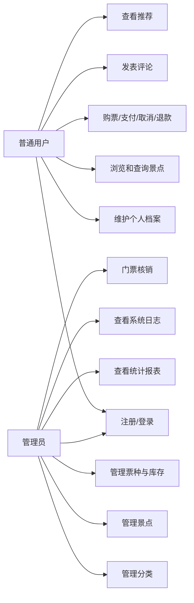

# 景点售票系统需求规格说明书

更新时间：2026-07-14（M11 实现校准）

## 1. 项目概述

景点售票系统面向景区售票与入园管理场景，提供用户注册登录、景点信息管理、票务订单管理、评论互动、行为日志记录、统计报表与推荐等功能。系统采用 MySQL 与 MongoDB 混合数据库架构：MySQL 负责用户、分类、景点、订单、档案等强一致结构化数据；MongoDB 负责行为日志、评论、景点详情、系统日志等高写入或半结构化数据。

## 2. 运行环境

| 项目 | 要求 |
| --- | --- |
| JDK | Java 21 |
| 构建工具 | Maven 3.8+ |
| 关系型数据库 | MySQL 8.0+ |
| 文档型数据库 | MongoDB 5.0+ |
| 前端界面 | Java Swing |
| 数据访问 | JDBC、MongoDB Java Sync Driver |
| 版本控制 | Git + GitHub/Gitee |

## 3. 用户角色

| 角色 | 说明 | 主要权限 |
| --- | --- | --- |
| 游客/普通用户 | 景区购票用户 | 注册、登录、档案、浏览/推荐、按票种日期购票、支付/取消/退款本人订单、评论、本人报表 |
| 管理员 | 景区后台管理人员 | 管理用户、分类、景点、票种、库存、核销，跨用户订单查询、统计报表、系统审计 |

## 4. 功能需求

### 4.1 用户管理

- 用户注册：填写用户名、邮箱、手机号、密码，密码使用 BCrypt 加密后存储。
- 用户登录：校验用户名和密码，登录成功后写入 MongoDB 系统日志。
- 用户资料维护：维护真实姓名、证件号、地址、个人简介等档案信息。
- 权限控制：根据 `ADMIN` 与 `USER` 角色展示不同功能入口。
- 服务授权：管理、审计和私有数据服务必须接收 actor 并从 MySQL 回查启用状态与角色，不能只依赖 Swing 隐藏按钮。

### 4.2 景点与票务管理

- 分类管理：支持树形分类，例如自然景观、历史文化、主题乐园等。
- 景点录入：管理员维护景点标题、分类、原价、优惠、状态、创建时间、更新时间。
- 景点详情：详细描述、图片、扩展属性存储到 MongoDB `item_details` 集合。
- 景点查询：支持按分类、关键字、状态分页查询。
- 票种管理：每个景点支持成人、儿童、学生及自定义票种，分别维护原价、优惠和上下架。
- 每日库存：每个票种按今天或未来游玩日期维护 available/reserved/sold 三段库存，使用事务行锁防超卖。

### 4.3 订单管理

- 创建订单：普通用户选择景点、票种、今天或未来日期、数量和付款方式，服务端重算价格，创建待支付订单并预留库存 15 分钟。
- 主动支付/取消：用户主动确认模拟支付；待支付订单可取消或到期释放预留库存。
- 模拟退款：仅游玩日期前、未完成、未核销的已支付订单可退款；退款记录、订单状态和库存恢复同一事务。
- 入园核销：管理员仅在游玩日期当天分批核销，累计数量达到订单数量后自动完成。
- 事务处理：创建、支付、取消、过期、退款和核销使用 JDBC 手动事务与行锁，失败时回滚。
- 订单查询：普通用户只能查看本人；管理员可跨用户查询，但他人支付/取消/退款按钮不启用。
- 订单状态：`0=待支付`、`1=已支付`、`2=已取消/已退款`、`3=已完成`，任意状态修改入口 fail-closed。

### 4.4 评论与互动

- 发表评论：用户对景点提交评分和文字评论。
- 评论资格：提交时回查当前账号有该景点已支付或已完成、且未退款订单；每用户每景点唯一，再次提交原位更新。
- 评论查询：按景点查询评论列表。
- 评论统计：使用 MongoDB 聚合管道统计评分分布和平均分。

### 4.5 行为日志

- 浏览记录：用户查看景点时写入 `action_logs`。
- 操作审计：登录、退出、关键后台操作写入 `system_logs`。
- 日志字段：记录用户、景点、行为类型、停留时长、客户端信息、时间。

### 4.6 数据统计与推荐

- 热门排行：按浏览量、订单量、评分聚合景点热度。
- 用户报告：统计用户浏览、下单、评论等行为。
- 月度报表：通过 MySQL 存储过程统计订单金额与数量。
- 推荐功能：基于用户浏览、评分、热门景点生成简单推荐列表。
- 系统审计：管理员按用户、类型、级别、起止日期、关键词和条数查询日志，并查看汇总、趋势和用户操作。

## 5. 非功能需求

- 安全性：所有 SQL 使用 `PreparedStatement`，禁止字符串拼接 SQL。
- 密码安全：密码不得明文存储，必须使用 BCrypt。
- 数据一致性：订单创建等核心业务必须显式事务管理。
- 可维护性：使用 DAO 模式分离数据访问层。
- 日志能力：使用 SLF4J + Logback 输出运行日志。
- 配置管理：数据库连接配置放在 `db.properties`，真实配置不提交仓库。
- 版本控制：每天至少提交一次，提交信息格式为 `[Day XX] 功能描述`。

## 6. 用例图

## 7. 验收标准

- 能够在本机 Java 21 环境中启动 Swing 应用。
- MySQL 与 MongoDB 脚本可从隔离空测试库验证，已有库通过版本化迁移升级且保留课程原字段。
- 用户、景点、票种库存、订单生命周期、退款、核销、评论、推荐、统计和审计可演示。
- 普通用户无法调用管理员服务；库存并发不超卖、不为负。
- 默认、真实 MySQL、真实 MongoDB、跨库、并发和双角色完整流程测试通过。
- Git 提交次数不少于 11 次，提交信息清晰。
- GitHub/Gitee 分支可访问，README、技术文档、用户手册、答辩材料和最终报告齐全。
