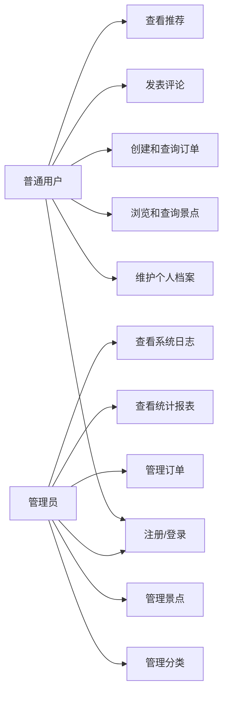

# 景点售票系统需求规格说明书

## 1. 项目概述

景点售票系统面向景区售票与入园管理场景，提供用户注册登录、景点信息管理、票务订单管理、评论互动、行为日志记录、统计报表与推荐等功能。系统采用 MySQL 与 MongoDB 混合数据库架构：MySQL 负责用户、分类、景点、订单、档案等强一致结构化数据；MongoDB 负责行为日志、评论、景点详情、系统日志等高写入或半结构化数据。

## 2. 运行环境

| 项目 | 要求 |
| --- | --- |
| JDK | Java 21 |
| 构建工具 | Maven 3.8+ |
| 关系型数据库 | MySQL 8.0.45 |
| 文档型数据库 | MongoDB 8.3.2 |
| 前端界面 | Java Swing |
| 数据访问 | JDBC、MongoDB Java Sync Driver |
| 版本控制 | Git + Gitee |

## 3. 用户角色

| 角色 | 说明 | 主要权限 |
| --- | --- | --- |
| 游客/普通用户 | 景区购票用户 | 注册、登录、浏览景点、下单、查询订单、发表评论 |
| 管理员 | 景区后台管理人员 | 管理用户、分类、景点、订单、统计报表、系统日志 |

## 4. 功能需求

### 4.1 用户管理

- 用户注册：填写用户名、邮箱、手机号、密码，密码使用 BCrypt 加密后存储。
- 用户登录：校验用户名和密码，登录成功后写入 MongoDB 系统日志。
- 用户资料维护：维护真实姓名、证件号、地址、备注等档案信息。
- 权限控制：根据 `ADMIN` 与 `USER` 角色展示不同功能入口。

### 4.2 景点与票务管理

- 分类管理：支持树形分类，例如自然景观、历史文化、主题乐园等。
- 景点录入：管理员维护景点标题、分类、状态、创建时间、更新时间。
- 景点详情：详细描述、图片、扩展属性存储到 MongoDB `item_details` 集合。
- 景点查询：支持按分类、关键字、状态分页查询。

### 4.3 订单管理

- 创建订单：普通用户选择景点后创建订单，写入 MySQL `orders` 表。
- 事务处理：订单创建必须使用 JDBC 手动事务，失败时回滚。
- 订单查询：支持按用户、景点、状态、时间范围查询订单。
- 订单状态：支持待支付、已支付、已取消、已完成等状态扩展。

### 4.4 评论与互动

- 发表评论：用户对景点提交评分、文字评论和标签。
- 评论查询：按景点查询评论列表。
- 评论统计：使用 MongoDB 聚合管道统计评分分布、平均分、热门标签。

### 4.5 行为日志

- 浏览记录：用户查看景点时写入 `action_logs`。
- 操作审计：登录、退出、关键后台操作写入 `system_logs`。
- 日志字段：记录用户、景点、行为类型、停留时长、客户端信息、时间。

### 4.6 数据统计与推荐

- 热门排行：按浏览量、订单量、评分聚合景点热度。
- 用户报告：统计用户浏览、下单、评论等行为。
- 月度报表：通过 MySQL 存储过程统计订单金额与数量。
- 推荐功能：基于用户浏览、评分、热门景点生成简单推荐列表。

## 5. 非功能需求

- 安全性：所有 SQL 使用 `PreparedStatement`，禁止字符串拼接 SQL。
- 密码安全：密码不得明文存储，必须使用 BCrypt。
- 数据一致性：订单创建等核心业务必须显式事务管理。
- 可维护性：使用 DAO 模式分离数据访问层。
- 日志能力：使用 SLF4J + Logback 输出运行日志。
- 配置管理：数据库连接配置放在 `db.properties`，真实配置不提交仓库。
- 版本控制：每天至少提交一次，提交信息格式为 `[Day XX] 功能描述`。

## 6. 用例图

## 7. 验收标准

- 能够在本机 Java 21 环境中启动 Swing 应用。
- MySQL 与 MongoDB 初始化脚本可执行。
- 用户、景点、订单、评论、日志、统计功能可演示。
- Git 提交次数不少于 11 次，提交信息清晰。
- Gitee 仓库可访问，README、技术文档、用户手册、答辩材料齐全。
